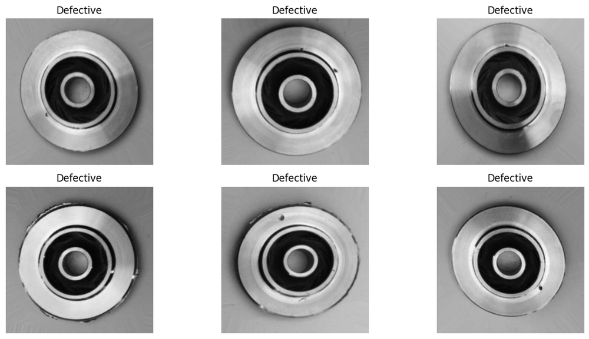
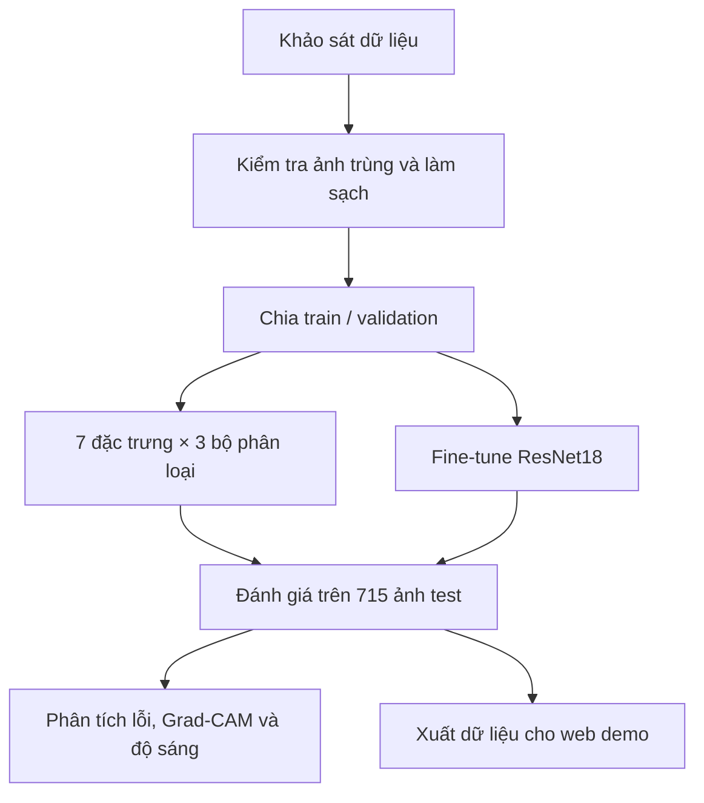
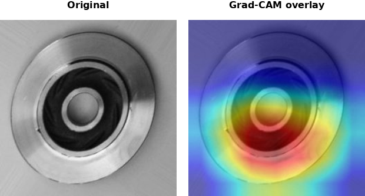

<div align="center">

# Casting Quality Inspection — ML & DL

**Phân loại lỗi trên ảnh sản phẩm đúc: so sánh 21 cấu hình Machine Learning với ResNet18, kiểm tra rò rỉ dữ liệu và độ nhạy với ánh sáng**


[](LICENSE)

[**Web demo**](https://peotrannnn.github.io/Casting-Quality-Inspection-using-ML-DL/) · [**Kết quả đã lưu**](docs/data/models.json) · [**Các notebook**](notebooks)



<sub>Hình 1. Một số mẫu thuộc lớp <code>def_front</code>. Hình dạng tổng thể tương tự nhau, trong khi các dấu hiệu lỗi có thể xuất hiện ở vành hoặc bề mặt chi tiết.</sub>

</div>

> [!NOTE]
> Đề tài được thực hiện với mục đích học tập và thực nghiệm trên một bộ dữ liệu công khai. Histogram + SVM đạt 99,86% accuracy trên tập test, nhưng kết quả giảm rõ rệt khi thay đổi phân bố độ sáng. Vì vậy, phần phân tích tập trung cả vào nguyên nhân tạo ra điểm số và những điều chưa thể kết luận về khả năng sử dụng thực tế.

---

## Khởi động nhanh

Để xem ảnh test, dự đoán của 22 mô hình và bảng so sánh, có thể mở [web demo](https://peotrannnn.github.io/Casting-Quality-Inspection-using-ML-DL/) hoặc chạy bản tĩnh tại máy:

```bash
git clone --depth 1 https://github.com/peotrannnn/Casting-Quality-Inspection-using-ML-DL.git
cd Casting-Quality-Inspection-using-ML-DL
python -m http.server 8000 --directory docs
```

Truy cập <http://localhost:8000>. Dashboard sử dụng kết quả đã tính sẵn, không cần cài PyTorch hay huấn luyện lại. Các tệp trọng số trong repo dùng Git LFS; chúng không cần thiết để xem dashboard. Hướng dẫn chạy notebook nằm ở [mục 10](#10-tái-lập-thí-nghiệm).

---

## Mục lục

1. [Phát biểu bài toán](#1-phát-biểu-bài-toán)
2. [Mục tiêu và thách thức](#2-mục-tiêu-và-thách-thức)
3. [Dữ liệu và cách chia tập](#3-dữ-liệu-và-cách-chia-tập)
4. [Quy trình thực hiện](#4-quy-trình-thực-hiện)
5. [Đặc trưng và mô hình](#5-đặc-trưng-và-mô-hình)
6. [Kết quả đánh giá](#6-kết-quả-đánh-giá)
7. [Kiểm tra rò rỉ dữ liệu](#7-kiểm-tra-rò-rỉ-dữ-liệu)
8. [Phân tích lỗi và ảnh hưởng của độ sáng](#8-phân-tích-lỗi-và-ảnh-hưởng-của-độ-sáng)
9. [Web demo](#9-web-demo)
10. [Tái lập thí nghiệm](#10-tái-lập-thí-nghiệm)
11. [Cấu trúc thư mục](#11-cấu-trúc-thư-mục)
12. [Hạn chế và hướng phát triển](#12-hạn-chế-và-hướng-phát-triển)
13. [Nguồn dữ liệu và giấy phép](#13-nguồn-dữ-liệu-và-giấy-phép)

---

## 1. Phát biểu bài toán

Cho một ảnh chụp mặt trước của cánh bơm chìm, mô hình cần dự đoán sản phẩm thuộc một trong hai lớp:

| Nhãn thư mục | Mã nhãn | Ý nghĩa |
|---|:---:|---|
| `def_front` | 0 | Sản phẩm có lỗi |
| `ok_front` | 1 | Sản phẩm đạt yêu cầu |

Đây là bài toán **phân loại ảnh nhị phân**. Dữ liệu không có bounding box hay mask của từng lỗi, nên mô hình không được huấn luyện để xác định chính xác vị trí, loại hoặc kích thước khuyết tật. Grad-CAM được dùng sau huấn luyện để quan sát vùng ảnh ảnh hưởng đến dự đoán.

Hai hướng tiếp cận được so sánh trên cùng tập test: trích xuất đặc trưng thủ công rồi huấn luyện bộ phân loại, và fine-tune một mạng CNN đã được huấn luyện trước trên ImageNet.

## 2. Mục tiêu và thách thức

Mục tiêu của đề tài là xây dựng một quy trình từ khảo sát dữ liệu đến đánh giá, phân tích lỗi và trình bày kết quả bằng web demo. Phần thực nghiệm trả lời ba câu hỏi:

1. Với bộ dữ liệu này, đặc trưng đơn giản có đủ để phân biệt sản phẩm lỗi và đạt yêu cầu không?
2. ResNet18 cải thiện kết quả đến mức nào so với các mô hình cổ điển?
3. Điểm số cao có còn giữ được sau khi xử lý ảnh trùng và thay đổi độ sáng?

| Thách thức | Cách xử lý trong đề tài |
|---|---|
| Ảnh hai lớp có hình dạng tổng thể gần giống nhau | So sánh đặc trưng cường độ, cạnh, kết cấu và đặc trưng học bởi CNN |
| Ảnh trùng giữa train và test làm sai lệch đánh giá | Quét MD5, chuyển bản trùng khỏi train, giữ nguyên test |
| Mô hình có thể dựa vào đặc điểm chụp ảnh | Phân tích thống kê theo lớp và thử cân bằng độ sáng |
| Accuracy không giải thích mô hình sai ở đâu | Lưu từng dự đoán, xem ảnh sai, Grad-CAM và UMAP |
| Đặc trưng ảnh có số chiều lớn, dễ thiếu RAM | Dùng raw pixels 64×64, đặc trưng cạnh dạng thống kê và xử lý lần lượt từng nhóm đặc trưng |

## 3. Dữ liệu và cách chia tập

Bộ dữ liệu [Casting Product Image Data for Quality Inspection](https://www.kaggle.com/datasets/ravirajsinh45/real-life-industrial-dataset-of-casting-product) do `ravirajsinh45` công bố trên Kaggle, gồm ảnh sản phẩm đúc của Pilot TechnoCast tại Shapar, Rajkot, Ấn Độ. Dự án sử dụng nhánh ảnh **300×300** trong `casting_data/casting_data/`.

### 3.1. Số lượng ảnh trước và sau làm sạch

| Tập dữ liệu | `def_front` | `ok_front` | Tổng |
|---|---:|---:|---:|
| Train gốc, trước khi loại ảnh trùng | 3.758 | 2.875 | 6.633 |
| Ảnh chuyển khỏi train | 0 | 64 | 64 |
| Train sau làm sạch, trước khi tách validation | 3.758 | 2.811 | 6.569 |
| Test, giữ nguyên | 453 | 262 | 715 |
| **Tổng ảnh sử dụng sau làm sạch** | **4.211** | **3.073** | **7.284** |

Tổng ban đầu là **7.348 ảnh**. Có 64 ảnh được giữ riêng trong `data/leaked_duplicates_removed_from_train/`, không dùng để huấn luyện. Các con số sau làm sạch có thể đối chiếu với [báo cáo leakage](results/metrics/leakage_check_report.json).

### 3.2. Train, validation và test

Tập train sau làm sạch được xáo trộn bằng `torch.randperm` với `seed = 42`, rồi tách 80/20: **5.256 ảnh train** và **1.313 ảnh validation**. Đây là phép chia ngẫu nhiên, không phân tầng theo lớp. Hai nhánh ML và DL sử dụng cùng quy tắc chia; 715 ảnh test nằm trong thư mục riêng.

Validation dùng để so sánh cấu hình và chọn checkpoint. Với ResNet18, phép biến đổi ngẫu nhiên chỉ áp dụng trên train. Các bước chuẩn hóa đặc trưng ML được fit trên train trong pipeline, sau đó áp dụng lên dữ liệu đánh giá.

## 4. Quy trình thực hiện



| Notebook | Nội dung chính | Kết quả hoặc vai trò |
|---|---|---|
| [01_EDA](notebooks/01_EDA.ipynb) | Khảo sát số lượng, kích thước và ảnh mẫu | Hiểu dữ liệu trước khi xây dựng mô hình |
| [02_check_data_pipeline](notebooks/02_check_data_pipeline.ipynb) | Kiểm tra cách chia tập và augmentation | Xác nhận pipeline nạp dữ liệu |
| [02a_leakage_check_and_cleanup](notebooks/02a_leakage_check_and_cleanup.ipynb) | Quét MD5 và chuyển ảnh trùng khỏi train | Báo cáo leakage; chạy trước các bước huấn luyện |
| [03_classical_features](notebooks/03_classical_features.ipynb) | Trực quan hóa đặc trưng thủ công | Quan sát thông tin mỗi đặc trưng giữ lại |
| [04_classical_ml](notebooks/04_classical_ml.ipynb) | So sánh mô hình cổ điển trên validation | Chọn baseline và lưu mô hình Histogram + SVM |
| [05_deep_learning](notebooks/05_deep_learning.ipynb) | Khảo sát fine-tune ResNet18 và thử nghiệm DL | Đường cong huấn luyện và so sánh mô hình |
| [06_model_testing](notebooks/06_model_testing.ipynb) | Đánh giá baseline, huấn luyện và lưu ResNet18 | Cross-validation cho baseline, khoảng tin cậy, checkpoint và kết quả test |
| [07_error_analysis](notebooks/07_error_analysis.ipynb) | Xem ảnh sai, Grad-CAM, thống kê theo lớp, equalization và UMAP | Hình phân tích, bảng robustness và dữ liệu UMAP |
| [08_classical_full_benchmark](notebooks/08_classical_full_benchmark.ipynb) | Đánh giá đủ 21 tổ hợp ML trên test | Trọng số, bảng metrics và dự đoán từng ảnh |
| [09_export_web_assets](notebooks/09_export_web_assets.ipynb) | Tổng hợp mô hình, ảnh, dự đoán và Grad-CAM | Các tệp JSON và ảnh trong `docs/` |

Notebook 05 còn chứa các cell thử EfficientNet-B0. Mô hình này chưa có kết quả trong benchmark cuối; số **22 mô hình** chỉ gồm 21 cấu hình ML và ResNet18.

## 5. Đặc trưng và mô hình

### 5.1. Bảy nhóm đặc trưng thủ công

| Đặc trưng | Thông tin biểu diễn | Số chiều trong benchmark |
|---|---|---:|
| Raw Pixels | Ảnh xám 64×64 được trải phẳng | 4.096 |
| Histogram | Phân bố cường độ xám, 256 bins | 256 |
| Sobel | Mean, std, min, max và 5 phân vị của độ lớn gradient | 9 |
| Canny | Tỷ lệ pixel cạnh, mean và std của ảnh cạnh | 3 |
| LBP | Histogram kết cấu cục bộ, uniform LBP với P = 8, R = 1 | 10 |
| HOG | Histogram hướng gradient, 9 hướng và cell 16×16 | 6.084 |
| GLCM | Contrast, dissimilarity, homogeneity, energy và correlation | 5 |

Sobel và Canny trong benchmark dùng **thống kê tổng hợp**, không dùng toàn bộ ảnh cạnh trải phẳng. Mã nguồn vẫn có cả hai dạng để phục vụ trực quan hóa và trích xuất.

Mỗi nhóm đặc trưng được thử với ba bộ phân loại:

| Bộ phân loại | Cấu hình chính |
|---|---|
| Logistic Regression | `StandardScaler` → `LogisticRegression(max_iter=2000, random_state=42)` |
| SVM | `StandardScaler` → `SVC(kernel="rbf", random_state=42)`; C và gamma dùng mặc định |
| Random Forest | 200 cây, `random_state=42`, `n_jobs=-1`; không dùng StandardScaler |

Có **7 × 3 = 21 cấu hình**. Đây là phép so sánh với cấu hình cố định, chưa phải kết quả tối ưu siêu tham số cho từng mô hình.

### 5.2. ResNet18

ResNet18 dùng trọng số ImageNet, thay lớp fully connected cuối bằng một lớp có hai đầu ra và fine-tune toàn bộ mạng.

| Thành phần | Thiết lập |
|---|---|
| Đầu vào | 224×224, ba kênh, chuẩn hóa theo mean/std ImageNet |
| Augmentation trên train | `RandomHorizontalFlip`, `RandomRotation(10)` |
| Optimizer | Adam, learning rate `1e-4` |
| Loss | CrossEntropyLoss |
| Batch size | 32 |
| Số epoch | 10 |
| Chọn checkpoint | F1 macro tốt nhất trên validation |

## 6. Kết quả đánh giá

Bảng dưới dùng các giá trị trong [docs/data/models.json](docs/data/models.json), là nguồn của dashboard. Các cấu hình được sắp theo accuracy; F1 trong bảng được tính thống nhất cho lớp dương **`ok_front` = 1**.

| Mô hình | Accuracy | F1 của `ok_front` | ROC AUC |
|---|---:|---:|---:|
| **Histogram + SVM** | **99,86%** | **0,9981** | **1,0000** |
| ResNet18 | 99,72% | 0,9962 | 1,0000 |
| Histogram + Random Forest | 99,30% | 0,9904 | 0,9998 |
| Raw Pixels + SVM | 98,88% | 0,9847 | 0,9966 |
| HOG + SVM | 98,60% | 0,9809 | 0,9991 |
| Raw Pixels + Random Forest | 97,62% | 0,9675 | 0,9966 |
| HOG + Random Forest | 97,20% | 0,9609 | 0,9975 |

Histogram + SVM dự đoán sai **1/715 ảnh**; ResNet18 sai **2/715 ảnh**. Chênh lệch một ảnh không đủ để kết luận mô hình nào sẽ tốt hơn trên một nguồn dữ liệu mới. ROC AUC bằng 1 cũng không có nghĩa mọi nhãn dự đoán đều đúng: AUC đánh giá thứ tự điểm số qua các ngưỡng, còn accuracy được tính tại quy tắc quyết định đang dùng.

<details>
<summary><strong>Xem 15 cấu hình còn lại</strong></summary>

| Mô hình | Accuracy | F1 của `ok_front` |
|---|---:|---:|
| HOG + Logistic Regression | 96,92% | 0,9588 |
| Histogram + Logistic Regression | 95,10% | 0,9307 |
| Sobel + Random Forest | 92,73% | 0,8930 |
| Raw Pixels + Logistic Regression | 91,89% | 0,8902 |
| Sobel + SVM | 91,89% | 0,8938 |
| GLCM + Random Forest | 86,29% | 0,7984 |
| GLCM + SVM | 82,80% | 0,7545 |
| LBP + Random Forest | 79,16% | 0,7151 |
| LBP + SVM | 79,02% | 0,7070 |
| GLCM + Logistic Regression | 78,32% | 0,6979 |
| LBP + Logistic Regression | 71,75% | 0,5590 |
| Sobel + Logistic Regression | 71,47% | 0,6554 |
| Canny + SVM | 70,63% | 0,6140 |
| Canny + Random Forest | 63,92% | 0,5343 |
| Canny + Logistic Regression | 59,86% | 0,4575 |

</details>

**Cách đọc các tệp kết quả.** [classical_full_test_results.csv](results/metrics/classical_full_test_results.csv) chứa đủ 21 cấu hình ML trên test; [classical_ml_results.csv](results/metrics/classical_ml_results.csv) là kết quả validation của bước khảo sát. Không ghép hai bảng thành một bảng xếp hạng chung. Trong [model_testing_results.csv](results/metrics/model_testing_results.csv), F1 của ResNet18 là **macro F1 = 0,9970**, khác F1 lớp `ok_front` ở bảng trên; đây là khác biệt về cách tổng hợp chỉ số.

Histogram không giữ vị trí pixel nhưng vẫn cho kết quả cao nhất. Điều này là lý do để kiểm tra kỹ phân bố cường độ sáng và ảnh trùng giữa các tập.

## 7. Kiểm tra rò rỉ dữ liệu

Notebook 02a so sánh mã băm MD5 của tệp ảnh giữa train và test. Kết quả phát hiện **64 cặp trùng hoàn toàn**, đều thuộc `ok_front`; không tìm thấy cặp tương ứng trong `def_front`.

64 ảnh này tương đương **24,4% số ảnh test của lớp `ok_front`**. Bản nằm trong train được chuyển sang `data/leaked_duplicates_removed_from_train/ok_front/`; bản test được giữ nguyên để tiếp tục đánh giá trên cùng 715 ảnh.

Quy trình xử lý gồm:

1. Ghi lại tên các cặp trùng và trạng thái di chuyển.
2. Loại các bản trùng khỏi dữ liệu dùng để chia train/validation.
3. Huấn luyện và đánh giá lại mô hình trên dữ liệu đã làm sạch.
4. Quét lại để xác nhận không còn tệp trùng hoàn toàn giữa train và test.

[Báo cáo đã lưu](results/metrics/leakage_check_report.json) ghi nhận `duplicate_count = 0` cho cả hai lớp sau làm sạch. MD5 chỉ kiểm tra tệp trùng byte; ảnh gần trùng, ảnh đã nén lại hoặc các ảnh chụp liên tiếp của cùng sản phẩm vẫn cần một bước kiểm tra riêng.

## 8. Phân tích lỗi và ảnh hưởng của độ sáng

### 8.1. Quan sát vùng ảnh bằng Grad-CAM

<p align="center">

<br><sub>Hình 2. Ví dụ Grad-CAM: vùng màu nóng thể hiện vùng có đóng góp lớn hơn vào điểm số của lớp đang xét.</sub>
</p>

Các ví dụ dự đoán đúng cho thấy vùng kích hoạt xuất hiện quanh lỗ tâm và vành chi tiết. Notebook cũng lưu ảnh dự đoán sai để đối chiếu; trong hai ảnh lỗi bị ResNet18 bỏ sót, vùng kích hoạt cần được xem cùng với nền và các vùng ngoài khuyết tật.

Grad-CAM hỗ trợ diễn giải định tính. Nó không chứng minh mô hình đã học đúng bản chất vật lý của lỗi, cũng không thay thế nhãn định vị khuyết tật.

### 8.2. Thử nghiệm cân bằng độ sáng

Phân tích theo lớp cho thấy ảnh `def_front` có độ sáng trung bình thấp hơn `ok_front` khoảng **10–11 mức trên thang 0–255**. Để khảo sát sự phụ thuộc vào đặc điểm này, notebook 07 chuyển ảnh sang LAB, áp dụng `cv2.equalizeHist` lên kênh L rồi đánh giá lại hai mô hình **mà không huấn luyện lại**.

| Mô hình | Accuracy trên ảnh gốc | Sau cân bằng độ sáng | Mức giảm |
|---|---:|---:|---:|
| Histogram + SVM | 99,86% | 63,36% | 36,50 điểm phần trăm |
| ResNet18 | 99,72% | 72,73% | 26,99 điểm phần trăm |

Nguồn: [robustness_brightness_equalization.csv](results/error_analysis/robustness_brightness_equalization.csv).

ResNet18 giữ được kết quả tốt hơn Histogram + SVM trong phép thử này, nhưng cả hai đều giảm mạnh. Kết quả cho thấy mô hình nhạy với phép biến đổi cường độ ảnh. Equalization cũng thay đổi tương phản của chi tiết, nên chưa thể quy toàn bộ mức giảm cho một “đường tắt” độ sáng hay xem đây là phép mô phỏng đầy đủ điều kiện nhà máy mới.

### 8.3. Biểu diễn đặc trưng bằng UMAP

Notebook 07 trực quan hóa histogram và đặc trưng học bởi ResNet18 trong không gian hai chiều. UMAP giúp quan sát các cụm và vị trí mẫu dự đoán sai; sự tách biệt trên hình là bằng chứng khám phá, không phải một chỉ số thay thế cho đánh giá trên dữ liệu độc lập.

## 9. Web demo

Dashboard được viết bằng HTML, CSS và JavaScript, với ba trang:

| Trang | Nội dung |
|---|---|
| [About](docs/index.html) | Giới thiệu bài toán, phương pháp và hình minh họa |
| [Playground](docs/playground.html) | Duyệt 715 ảnh test, so sánh dự đoán của 22 mô hình và xem Grad-CAM của ResNet18 |
| [Model Stats](docs/stats.html) | Bảng kết quả, thông tin leakage và biểu diễn UMAP |

Dự đoán được tính trước trong Python rồi xuất thành JSON: **715 ảnh × 22 mô hình = 15.730 dự đoán**. Trình duyệt đọc các tệp này; dashboard hiện chưa thực hiện inference trên ảnh mới do người dùng tải lên.

Sau khi thay đổi hoặc huấn luyện lại mô hình, chạy notebook 07 nếu cần cập nhật UMAP, notebook 08 để xuất benchmark ML, rồi notebook 09 để cập nhật tài nguyên web. Có thể phục vụ `docs/` bằng lệnh ở phần Khởi động nhanh. Khi dùng GitHub Pages, chọn **Settings → Pages → Deploy from a branch → main → /docs** nếu nhánh xuất bản là `main`.

## 10. Tái lập thí nghiệm

### 10.1. Cài đặt môi trường

Chạy các lệnh sau từ thư mục gốc của repo. Repo chưa có tệp khóa phiên bản thư viện; danh sách dưới đây bao gồm các thư viện dùng trong notebook, nhưng không bảo đảm tái lập bit-for-bit môi trường đã tạo ra kết quả hiện tại.

```bash
python -m venv .venv
```

Kích hoạt trên **Windows PowerShell**:

```powershell
.\.venv\Scripts\Activate.ps1
```

Hoặc trên **macOS/Linux**:

```bash
source .venv/bin/activate
```

Cài thư viện và mở notebook:

```bash
python -m pip install numpy pandas scipy matplotlib tqdm joblib pillow opencv-python scikit-image scikit-learn torch torchvision kagglehub grad-cam umap-learn jupyter
jupyter notebook notebooks/
```

Dashboard và các thí nghiệm ML có thể chạy trên CPU. GPU giúp rút ngắn thời gian fine-tune ResNet18; không có benchmark thời gian CPU/GPU đầy đủ trong repo.

### 10.2. Dữ liệu và trọng số

Repo có thư mục dữ liệu, kết quả và các đường dẫn trọng số. Các tệp `*.joblib` và `*.pt` được quản lý bằng **Git LFS**. Nếu chúng chỉ là tệp văn bản nhỏ chứa LFS pointer, cài Git LFS rồi chạy:

```bash
git lfs install
git lfs pull
```

Chỉ cần tải lại dữ liệu khi thư mục ảnh bị thiếu hoặc khi muốn bắt đầu từ dữ liệu gốc:

```bash
python src/data/00_download_data.py
```

Script dùng `kagglehub` và ghi vào `data/raw/`. Nếu tải lại bản gốc, cần chạy lại notebook **02a** trước khi huấn luyện vì bản gốc có các ảnh trùng đã nêu ở mục 7.

### 10.3. Thứ tự chạy và các thiết lập cần kiểm tra

1. Mở notebook 01 và 02 để kiểm tra dữ liệu và pipeline.
2. Chạy 02a để kiểm tra hoặc thực hiện làm sạch; sau đó chạy 03 và 04.
3. Trong notebook 05, đổi `PROJECT_ROOT = Path(r"D:\Casting Quality Inspection")` thành đường dẫn repo trên máy. Nếu kernel đang ở `notebooks/`, có thể dùng `PROJECT_ROOT = Path("..").resolve()`.
4. Notebook 05 dùng để khảo sát DL và còn có các cell so sánh phụ thuộc vào EfficientNet-B0; không thể bỏ riêng phần huấn luyện EfficientNet rồi chạy nguyên phần so sánh phía sau. Để tái lập checkpoint ResNet18 dùng trong benchmark hiện tại, sử dụng phần huấn luyện và lưu trọng số ở notebook 06.
5. Chạy 06 để huấn luyện, đánh giá và lưu `models/resnet18_casting.pt`, rồi chạy 07 để phân tích lỗi. Chạy 08 và 09 để cập nhật đầy đủ benchmark và dashboard.

Các notebook dùng nhiều đường dẫn tương đối dạng `../data` và `../models`, nên cần giữ working directory của kernel tại `notebooks/`. Kiểm tra đường dẫn nạp/lưu checkpoint trước khi chạy; các bước huấn luyện và xuất dữ liệu có thể ghi đè kết quả cũ.

## 11. Cấu trúc thư mục

| Đường dẫn | Nội dung |
|---|---|
| `data/raw/casting_data/casting_data/` | Ảnh train/test theo lớp |
| `data/leaked_duplicates_removed_from_train/` | 64 ảnh được chuyển khỏi train |
| `notebooks/` | Khảo sát, huấn luyện, đánh giá và xuất dữ liệu web |
| `src/data/` | Script tải dữ liệu và tạo DataLoader |
| `src/features/` | Các hàm trích xuất histogram, cạnh, kết cấu, HOG và raw pixels |
| `src/models/` | Mã liên quan đến mô hình ML/DL |
| `src/inference/registry.py` | Khai báo mô hình và metadata dùng khi xuất demo |
| `src/explainability/` | Tiện ích Grad-CAM |
| `models/classical/` | Trọng số 21 cấu hình ML, dùng Git LFS |
| `models/classical_histogram_svm.joblib` | Baseline dùng trong các notebook đánh giá và phân tích lỗi |
| `models/resnet18_casting.pt` | Checkpoint ResNet18, dùng Git LFS |
| `results/metrics/` | Bảng đánh giá và báo cáo leakage |
| `results/predictions/` | Dự đoán từng ảnh của các mô hình ML |
| `results/error_analysis/` | Ảnh sai, Grad-CAM và kết quả thử nghiệm độ sáng |
| `docs/` | Dashboard tĩnh, dữ liệu JSON và hình minh họa |

## 12. Hạn chế và hướng phát triển

| Hạn chế hiện tại | Hướng kiểm tra hoặc cải thiện |
|---|---|
| Dữ liệu đến từ một nguồn chụp | Đánh giá trên ảnh từ camera, dây chuyền hoặc điều kiện chụp khác |
| Kết quả giảm mạnh sau equalization | Thử brightness/contrast augmentation và đo lại bằng cùng giao thức |
| MD5 chỉ phát hiện tệp trùng hoàn toàn | Kiểm tra near-duplicates và chia tập theo sản phẩm/lô chụp nếu có metadata |
| Chỉ có nhãn phân loại toàn ảnh | Bổ sung nhãn vùng lỗi nếu cần detection hoặc segmentation |
| Chưa có tìm kiếm siêu tham số có hệ thống | Tuning bằng train/validation, giữ một tập test độc lập cho đánh giá cuối |
| F1 nhị phân hiện dùng lớp `ok_front` làm lớp dương | Báo cáo thêm recall của `def_front` và tỷ lệ sản phẩm lỗi bị chấp nhận nhầm |
| Một số nhận xét hoặc hình cũ trong notebook có thể thuộc lần chạy trước | Chạy lại toàn bộ và đồng bộ mã, bảng số liệu, hình và nội dung diễn giải |
| Môi trường chưa khóa phiên bản, còn đường dẫn cục bộ | Bổ sung requirements có phiên bản và cấu hình đường dẫn dùng chung |
| Demo dùng dự đoán đã tính sẵn | Xây dựng inference cho ảnh mới và đo latency nếu mở rộng thành ứng dụng |

Bước tiếp theo có ý nghĩa nhất là đánh giá trên dữ liệu có điều kiện chụp khác và kiểm tra tỷ lệ bỏ sót sản phẩm lỗi. Hai việc này giúp xác định giá trị sử dụng của mô hình rõ hơn việc chỉ tăng thêm accuracy trên 715 ảnh hiện tại.

## 13. Nguồn dữ liệu và giấy phép

- **Dữ liệu:** [Casting Product Image Data for Quality Inspection — ravirajsinh45](https://www.kaggle.com/datasets/ravirajsinh45/real-life-industrial-dataset-of-casting-product), ảnh sản phẩm của Pilot TechnoCast.
- **Mã nguồn:** phát hành theo giấy phép [MIT](LICENSE).
- **Dữ liệu bên ngoài:** điều khoản sử dụng theo nguồn Kaggle; giấy phép MIT của mã nguồn không thay thế giấy phép của bộ dữ liệu.
